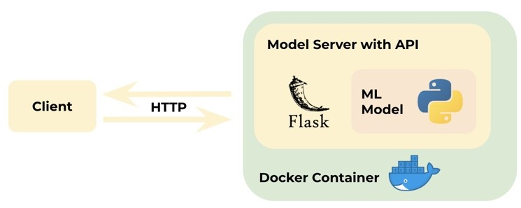
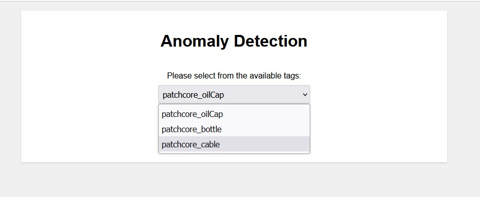
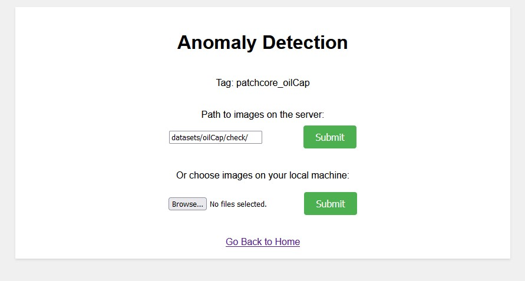
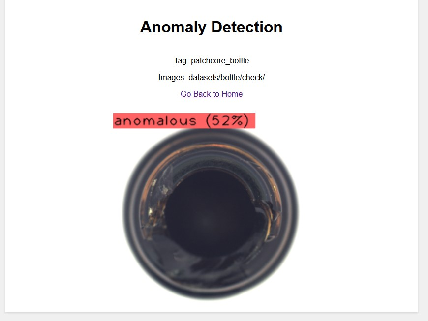

# Anomaly Detection - PatchCore

## Introduction
Anomalib is a deep learning library with the goal of gathering cutting-edge anomaly detection techniques for assessing performance on both publicly available and private datasets. It offers a variety of pre-built implementations of anomaly detection algorithms discussed in recent research, along with a toolkit to streamline the creation and utilization of customized models. The objective of this repository is to streamline the deployment process for the Anomalib library. We leverage Docker and Flask to offer a straightforward installation and create a more user-friendly environment. You need a linux server with gpu. Install Docker, NVIDIA Container Toolkit, VSCode and Remote-Containers extension.  
<p align="center">
	
</p>
## Preparing the environement  
1- Get the latest code: ```git clone --branch version02 --single-branch https://github.com/Hamoon1987/my_anomalib.git``` and afterwards ```cd my_anomalib```    
2- Build the docker image: ```docker build . --tag=anomalib```  
3- Run the docker image: ```docker run -it -d --gpus all --name my_anomalib anomalib```  
4- Attach to the running container  
  
## Training
1- Put the normal, abnormal, and the images you want to check afterwards in ```datasets/<product_name>/normal```, ```datasets/<product_name>/abnormal```, and ```datasets/<product_name>/check``` folders respectively   
Example: ```datasets/cable/normal```, ```datasets/cable/abnormal```, and ```datasets/cable/check```  
If abnormal images are not available you can just put some normal images inside (evaluation option won't be available). Also, you can add inference images to the check folder later or you can upload the files from local machine during the inference time  
2- Set the training configuration: ```python changeConfig.py --product <product_name> --path ./datasets/<product_name> --model <model_name>  --tag <tag_name>```  
Example: ```python changeConfig.py --product cable --path ./datasets/cable --model patchcore  --tag patchcore_cable_v01```  
3- To trian the model: ```python tools/train.py --tag <tag>```  
Example: ```python tools/train.py --tag patchcore_cable_v01```  
4- To evaluate the model: ```python tools/test.py --tag <tag_name>``` 
Example:  ```python tools/test.py --tag patchcore_cable_v01```  

## Inference
1- After training the models, run the app: ```python app.py```  
2- Choose the model tag from the dropdown menu  
<p align="center">
	
</p>
3- Set the path to the inference images on the server or choose the images from your local machine   
<p align="center">
	
</p>
4- The results will be shown afterwards:  
<p align="center">
	
</p>

## Acknowledgments
Code was adapted from/influenced by the following repos - thanks to the authors!
- [Anomalib](https://github.com/openvinotoolkit/anomalib)
- [Patchcore](https://github.com/amazon-science/patchcore-inspection)

